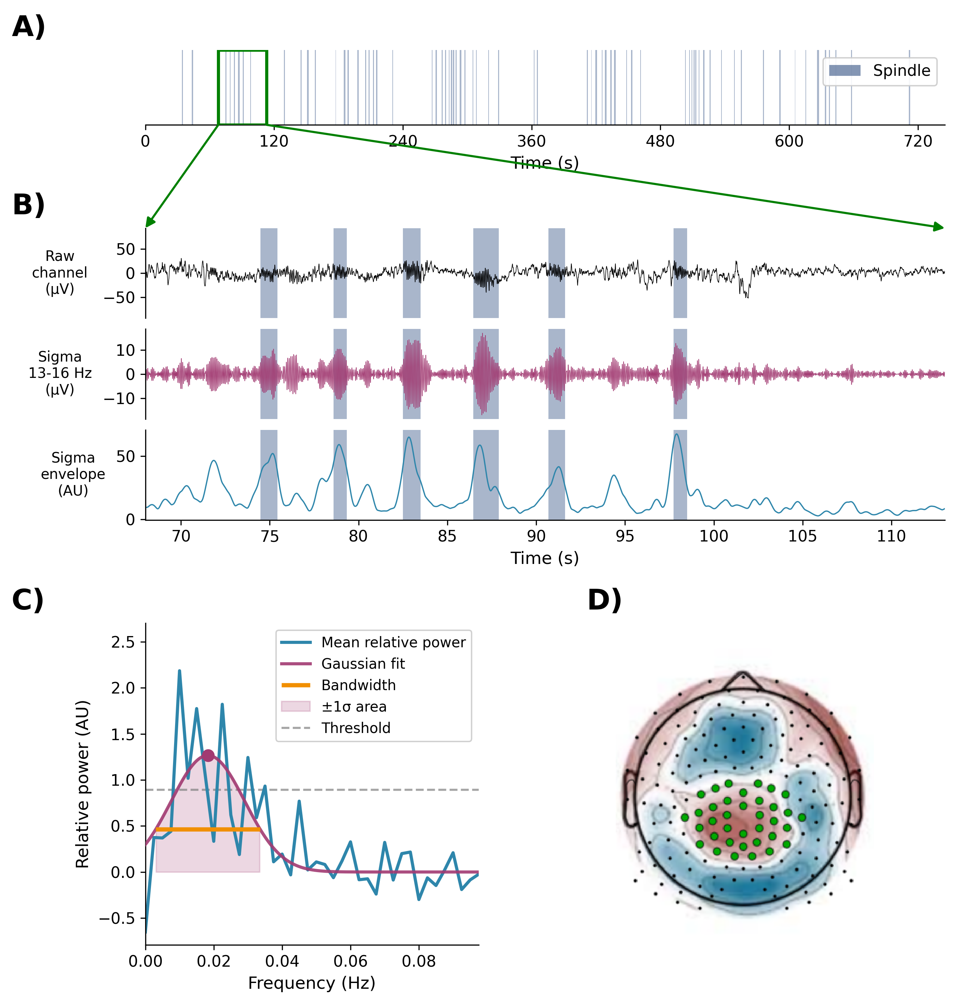
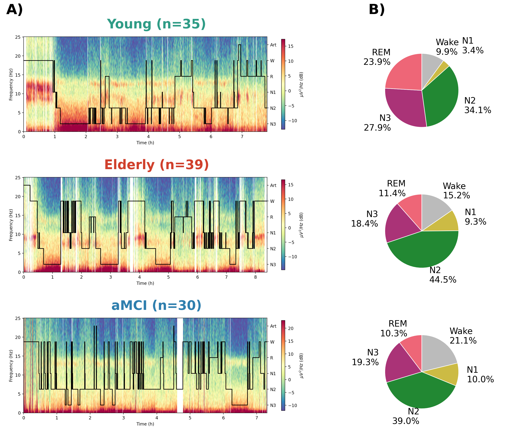
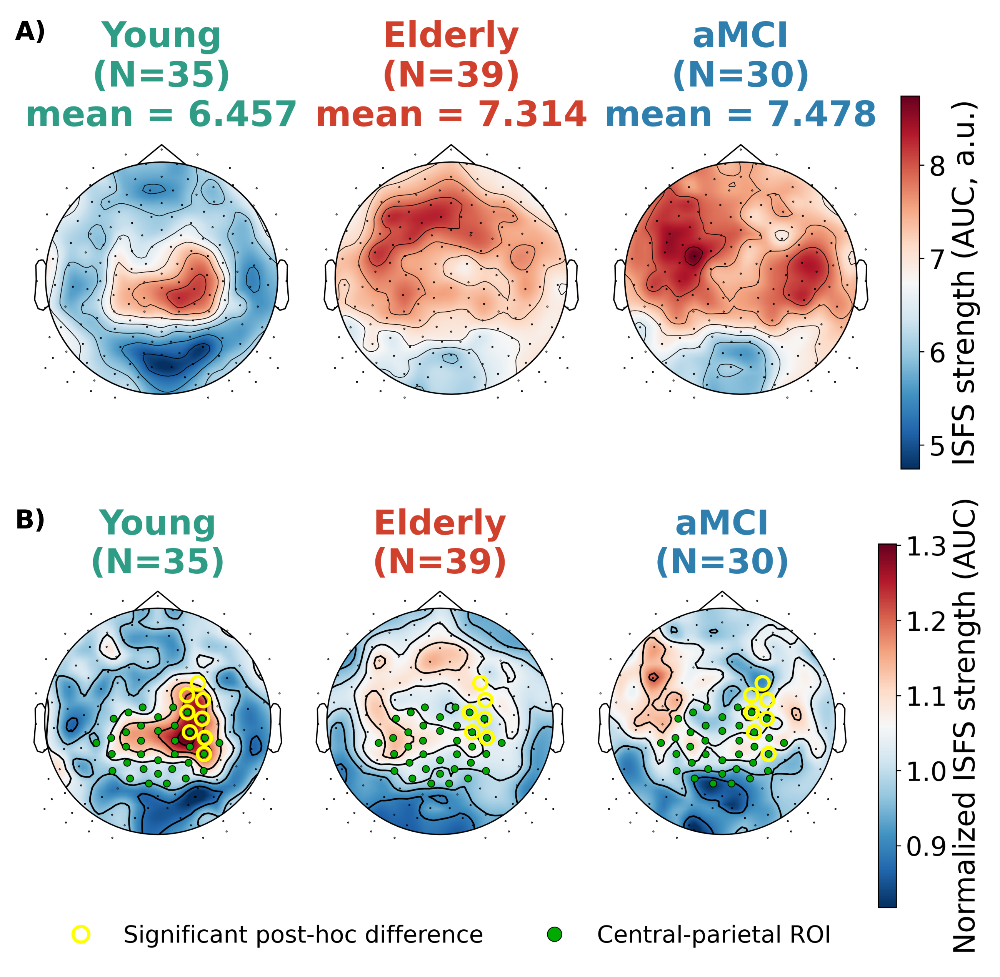
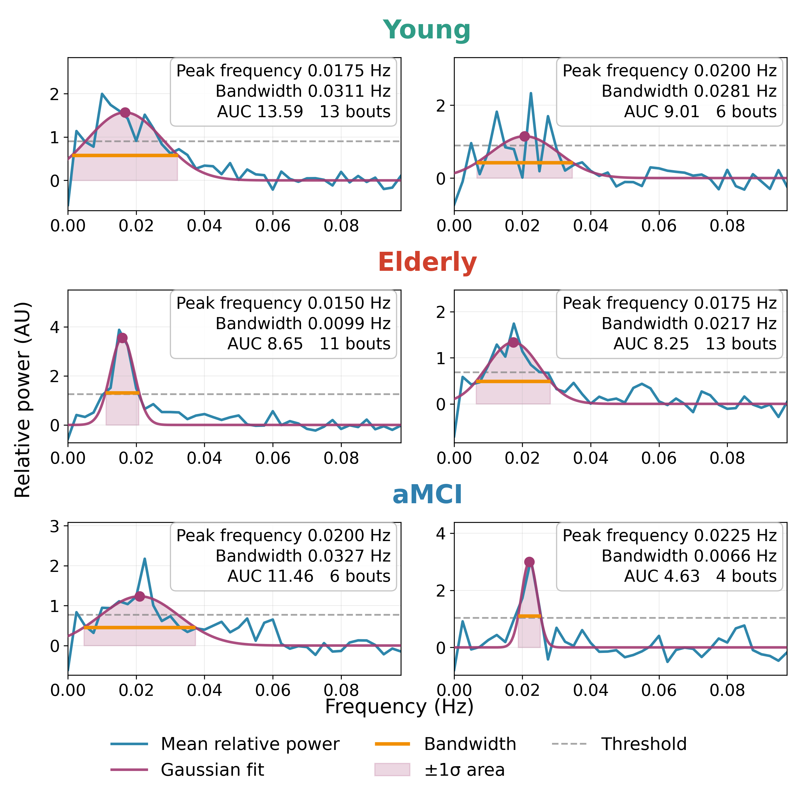
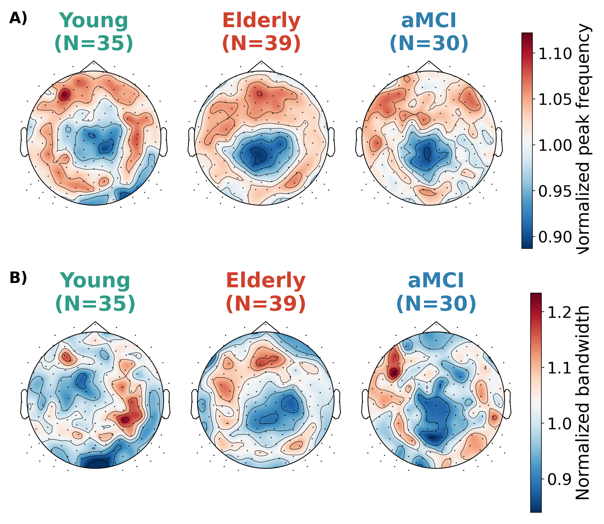

# Figure & Table manifest

_Rule: **always use the highest-V subfolder** — but applied **per figure**, not per folder. Walked `results/` on 2026-05-28; verified again 2026-05-31._

> **Figure assets (2026-08-13, → V11):** answering Yuval's review (C389, C390, C487, C502, C591, C592, email #6), every display item was regenerated with one group palette and page-legible fonts. **The numbers of record are still V10** — no statistic was recomputed. Regenerated group-comparison panels are in `three_groups_V11`, the composites are `thesis/figures/{hypno_sleep_stages,f4_auc_composite,s1_topo_composite}_V11.png`, the restyled S2 grid is in `moca_correlation_V4`, and the new Table 2 is in `demographics_V4`. The V10 assets are untouched and remain valid; V11 differs from V10 in graphics only.
>
> Palette, shared by every figure and defined once in `code/utils/config.py` (`GROUP_COLORS`, `GROUP_COLORS_DARK`): Young `#8dd3c7` green, Elderly `#fb8072` red, MCI `#80b1d3` blue, with darkened variants for text and markers.

> ### ⇨ FIGURES SESSION DONE (2026-08-17) — read this before touching any figure
>
> The whole figure set is now in the Doc and current. Record: `thesis/reviews/figures_edits_before_after.md`.
>
> - **The numbering changed.** The methods-flow figure is now **Figure 1** and the sleep overview **Figure 2**. Moving the sleep overview into Results 4.1 (C412) put it behind the methods-flow figure, which Methods 3.4 cites first, so a reader would have met Figure 2 before Figure 1. Renumbered in the Doc, in `03_methods.md` / `04_results.md`, and in this file.
> - **Table 2 is a native Docs table**, not the PNG. At page width the 20.5 in PNG rendered around 6 pt type, which is the same complaint C389 raised about panel C. The PNG survives as this file's preview and as the source of record; the Doc carries a 10-column, 9 pt table built from `demographics_V4/table2_sleep_architecture.csv`. Both "(Table 2)" pointers in Results 4.1 now resolve.
> - **Every figure says aMCI now.** The V11 assets all still drew "MCI" while every caption said "aMCI"; `grep -rn aMCI code/` returned nothing. Fixed by `GROUP_DISPLAY` / `group_label()` in `code/utils/config.py`, applied at the six sites that draw text. **Do not rename the palette dict keys** — 'MCI' is also a colour-lookup key, a result-directory name, and a literal in `three_groups_V10/three_group_topo_statistics.txt`, which `replot_topos_paper.py` parses. The V11 files were overwritten in place, by decision; no V12 exists.
> - **Figure 3 was reshaped** from 7.5 × 16.2 in to 9.5 × 11.4 (`step6_groups_comparison.py:1120`). At 2.13:1 it could only be sized to the page *height*, which capped it at 4.2 in wide and pushed its caption to the next page. The top significance bracket also gained headroom (`:1271`) because the 28 pt asterisk was riding up into the panel title.
> - **C432 is closed**, and it renumbered the supplementary set. Six hand-picked example spectra, built by the new `code/make_s3_figure.py`, are cited at the end of Results 4.1 — ahead of the other two supplementary figures — so example spectra are now **Figure S1**, the peak-frequency and bandwidth topographies **Figure S2**, and the MoCA grid **Figure S3**. Two traps in the per-channel outputs are documented in the S1 block below; read them before plotting these spectra again. Note the asset and its script keep their `s3_` / `make_s3_` names from when the figure was numbered S3.
> - **The preamble below is now C429-consistent** (fixed 2026-08-17): it no longer tells you to report bandwidth as a trend, and it names `demographics_V4` / `moca_correlation_V4` alongside V3. The two empty heading paragraphs in the Doc are also gone. **Still open, by decision:** the "MCI" header baked into Table 1's PNG — preview only, the Doc's Table 1 is a native table that already reads aMCI.
> - **Figure 5's image in the Doc is deliberately left at 3.1 × 3.6 in.** It was made inline and re-pointed at the V11 asset; Shaked reviewed the small size on the page and kept it (2026-08-17). Do not "fix" it.

> **Source-of-truth (2026-06-17, FINAL cohort N=35 / 39 / 30 → V10):** after tightening the exclusion criteria (≥3 clean N2 bouts, TST ≥ 210 min, DS6 re-included in Elderly, MR5 added to MCI, HG78/MCI13/SM07 dropped), all group-comparison outputs are regenerated in `three_groups_V10` — violins + stats, the AUC/peak-frequency/bandwidth topos (option-B head-clipped), the per-group topographies, and the topo cluster stats. Demographics/sleep are in `demographics_V3`, MoCA in `moca_correlation_V3`; the F1/F4/S1 composites are `thesis/figures/hypno_sleep_stages_V10.png`, `f4_auc_composite_V10.png`, `s1_topo_composite_V10.png`. V9 is the old N=36 set, V7/V8B the old N=35 sets, V5/V6 the old N=34 sets; do not pull from them anymore. **Headline change vs V9: bandwidth flipped from borderline-significant (p=0.038) to NOT significant (p=0.061).**

---

## Discovered figure inventory (results/ walk)

### Between-group comparison — `results/group_comparison_results/three_groups_V6/` (latest; V1–V6 exist)

| File | Type | Notes |
|------|------|-------|
| `group_comparison_violin_extended_ROI_normalized_auc.png` | violin, 3 groups | **THIS IS THE CANONICAL ROI VIOLIN** (the ROI, normalized AUC; "extended" in the filename is the internal variant label, never shown to readers) |
| `three_group_statistics_extended_ROI_normalized_auc.txt` | stats | ANOVA/Tukey or non-param results for the above |
| `group_comparison_violin.png` | violin | Generic — verify which metric; may be raw AUC. Use only if needed for supplementary. |
| `three_group_statistics.txt` | stats | Generic stats text |

### Per-group topographies (top-level PNGs)

| File | Group | Type |
|------|-------|------|
| `results/new_iso_results/Young_topographies_avg_raw.png` | YA | Raw mean topography (peak freq / BW / AUC / peak power × group) |
| `results/new_iso_results/Young_topographies_avg_normalized.png` | YA | Normalized (per-subject) topography |
| `results/new_elderly_results/Elderly_topographies_avg_raw.png` | HE | Raw |
| `results/new_elderly_results/Elderly_topographies_avg_normalized.png` | HE | Normalized |
| `results/new_MCI_results/MCI_topographies_avg_raw.png` | MCI | Raw |
| `results/new_MCI_results/MCI_topographies_avg_normalized.png` | MCI | Normalized |

### Per-group supplementary plots — `results/new_*_results/a_group_plots_V2/`

(Same structure for YA, HE; MCI also has V2.)

| File | Type | Notes |
|------|------|-------|
| `group_average_violin.png` | violin | Within-group ISFS metric distribution |
| `group_ISFS_spectral_power_all_channels.png` | spectrum | Mean ISFS spectrum across channels |
| `group_ISFS_spectral_power_VREF.png` | spectrum | VREF channel only |
| `peak_frequency_raw_channels_violin.png` | violin | Per-channel peak-frequency distribution |
| `E101_violin_box_dots.png` | violin | Single channel (E101) violin — likely Methods illustration |
| `Young_topographies_avg_*.png` | topo | Same as top-level — likely older copy |

### Demographics & sleep architecture — `results/demographics_V1/`

| File | Type | Notes |
|------|------|-------|
| `demographics_table.png` / `.csv` / `.txt` | table | Cohort demographics — **superseded by `cohort_table.md` from Google Sheet** for thesis use |
| `n2_bouts_table.png` / `.csv` / `.txt` | table | Per-subject N2 bout counts |
| `sleep_stage_pies.png` | figure | Sleep architecture pie charts per group |
| `sleep_stage_stats.txt` | stats | Per-group sleep stage statistics |
| `n2_bouts_per_subject.csv` | data | Long-form subject × bout data |
| `sleep_stage_means.csv` | data | Group means per stage |

### MoCA correlation — `results/moca_correlation_V2/`

| File | Type | Notes |
|------|------|-------|
| `moca_correlations_grid.png` | figure | Correlation grid (ISFS metric vs MoCA) — optional Results §4.6 |
| `correlation_summary.csv` | data | Correlation coefficients + p-values |
| `subject_scalars.csv` | data | Per-subject MoCA + ISFS scalars |

### Hypnospectrograms — `results/hypnospectrograms/`

| File | Type | Notes |
|------|------|-------|
| `EL3011_hypnospectrogram.png` | figure | YA example |
| `MCI27_hypnospectrogram.png` | figure | HE example (note: MCI-prefixed but `MCI27` is actually in HE group per Google Sheet) |
| `YS0_hypnospectrogram.png` | figure | MCI example |

---

## LOCKED main-text figure set (revised 2026-06-03 after supervisor talk)

**Table 1** (demographics) + **Table 2** (sleep) + **5 main figures** + **3 supplementary** (S3 added 2026-08-17 for C432). Status — **READY**: PNG exists; **RE-PLOT**: exists but needs composing/relabel. Group-comparison outputs now target `three_groups_V10`.

Each figure has a **Caption** (paper-ready prose, drop straight under the figure in the manuscript) and a separate **Supports** bullet noting the claim it backs. Captions avoid em-dashes and other AI tells (humanizer pass); interpretive claims are kept out of the caption text on purpose. Statistics are from the **V10** stats files (N=35 young / 39 elderly / 30 aMCI), with demographics and sleep from `demographics_V3` **and `demographics_V4`** (the latter holds Table 2 and the sleep-continuity measures) and MoCA from `moca_correlation_V3` (rendered as `moca_correlation_V4`), unless flagged otherwise. The V11 assets re-render these same numbers; nothing was recomputed.

> **Current stat state (2026-06-17, FINAL cohort N=35 / 39 / 30 → V10, after tightening the exclusion criteria — ≥3 clean N2 bouts, TST ≥ 210 min, DS6 re-included, MR5 added, HG78/MCI13/SM07 dropped):** peak frequency significant (ANOVA p = 0.0026); **bandwidth is NOT significant** (ANOVA p = 0.061) — it was borderline significant at N=36 (p = 0.038) and ns at N=35 (p = 0.052), so it has flipped sig↔ns with cohort composition. **Superseded 2026-08-15 by C429: do NOT describe it as a trend.** Entering analyzed N2 duration as a covariate weakens it further (p = 0.061 → 0.206), and duration is itself the stronger predictor (r = 0.386; covariate partial η² = 0.128 against group's), so Results 4.2 and the Discussion now report the bandwidth difference as largely an artefact of analyzed N2 duration and not interpretable as an effect of age. Whole-scalp AUC unchanged (KW p = 0.38, ns). The central-parietal AUC cluster holds, slightly weaker: p = 0.023, 9 electrodes (E142 dropped relative to V9). ROI normalized AUC ns (ANOVA p = 0.143). Elderly = MCI on every measure; MoCA null (pooled n = 44).

### T1 — Participant demographics table · *Methods (Participants)* · READY (N=35/39/30)
_`results/demographics_V3/demographics_table.png` — regenerated 2026-06-17 at the final cohort (Young n=35, Elderly n=39, MCI n=30) after the exclusion-criteria tightening. Sheet-driven, so it self-corrected to the new cohort (DS6 added to Elderly, MR5 to MCI, HG78/MCI13/SM07 excluded). (Presented as Table 1, not a figure.)_

**Caption:**
> *Table 1. Participant demographics by group.* For each group the table reports sample size (with the split between the Tel Aviv [TASMC] and Sydney [Woolcock] recording sites), age, and cognitive screening score (Montreal Cognitive Assessment, MoCA, where available), with exclusion counts and reasons summarized below. Values are mean ± standard deviation.

- **Supports:** the groups differ in age as expected; defines the analysed sample and its recording-site composition.

### T2 — Sleep architecture, sleep continuity and N2 bout properties · *Results* · READY (V11, N=35/39/30)
_`results/demographics_V4/table2_sleep_architecture.png` (+ `.csv`), built by `code/make_table2_sleep.py`. **New 2026-08-13**, closing C389, C390 and email #5 together: this is Figure 1's old panel C promoted out of the composite, where it was an unreadable pasted bitmap. Three section bands — sleep architecture (5 stage rows), **sleep continuity (4 new rows: WASO, sleep onset latency, REM sleep latency, sleep efficiency)**, and N2 bout properties (5 rows) — with two columns added beyond the old panel: the omnibus **Test** name and the **η²** effect size. 20 pt type, 17 in wide. **Spacing pass 2026-08-13:** row height raised (`row_scale` 2.4 → 3.3) because the table read as too dense; the band labels shortened to "Sleep architecture (%)" / "Sleep continuity" / "N2 bout properties", since the band label is the longest string in column 0 and was what made that column look unbalanced (the "(%)" is kept because those five rows carry no unit of their own, unlike the other two sections); and the on-figure title and footnote both removed — the title would only repeat the caption, matching F3 / F5 / S2, and the footnote definitions (mean ± SD, WASO, KW, η², the dash, bold) now live in the caption below. The dropped qualifiers "of total recording time" and "≥ 300 s" are stated in the caption too, and the CSV keeps the fully qualified section names. Rendering reuses `combined_demographics_table.render` (which gained optional `fontsize` / `fig_width` / `show_test_and_eta` / `title` / `footer` / `row_scale` arguments, all defaulting to the old behaviour, so `demographics_V3/combined_sleep_n2_table.png` still reproduces unchanged). Nothing is recomputed: the architecture and bout rows come from `demographics_V3/{combined_sleep_n2_table.csv, sleep_stage_stats.txt, n2_bouts_table.csv}` and the continuity rows from `demographics_V4/sleep_statistics_table.csv`._

**Caption:**
> *Table 2. Sleep architecture, sleep continuity and N2 bout properties by group.* Values are mean ± standard deviation. Sleep architecture is expressed as a percentage of total recording time, and a bout is a stretch of NREM2 of at least 300 s that survived artifact rejection. WASO is wake after sleep onset. The omnibus test for each row is a one-way ANOVA or a Kruskal–Wallis test (KW), chosen by normality (Shapiro–Wilk), and η² is the corresponding effect size; Tukey HSD or Holm-corrected Dunn post-hoc tests were run only where the omnibus test was significant, and a dash marks the comparisons that were therefore not run. Bold marks p < 0.05. Wake, N1, wake after sleep onset and the number of N2 bouts all increase with age, while N3, REM sleep and sleep efficiency decrease; sleep onset latency did not differ across groups (p = 0.38). Elderly and aMCI did not differ significantly on any measure.

- **Supports:** the age-related sleep changes are the expected normative ones, and N2 remains plentiful in all groups. Also gives the exclusion- and quality-relevant continuity measures Yuval asked for (C390).

### F1 — ISFS concept, feature extraction, and ROI definition (methods flow) · *Methods* · READY
_`thesis/figures/methods_flow_roi_v3.png` — fully code-generated by `code/make_f2_figure.py` (rewritten 2026-06-15; no more screenshot compositing). Every panel is a real matplotlib plot from one example subject (RD43, channel VREF). A) spindle timeline over the 745 s example N2 bout (crop 7418–8163 s), bottom-axis only, with green arrows opening the 68–113 s window into B). B) three stacked traces over that window — raw channel, 13–16 Hz sigma, Gabor sigma envelope — with detected spindles shaded; the two upper traces are drawn thin and the raw trace is y-squeezed. C) mean envelope FFT + Gaussian fit computed by the production pipeline over **all** of RD43-VREF's clean N2 bouts (`extract_clean_sleep_bouts` → Gabor envelope → `extract_isfs_parameters`; 5 bouts / 86.6 min), left+bottom axes only. D) the central-parietal ROI map (`code/debug/AUC ROI 2.png`). **Portrait layout** (9.5×9.8, rebuilt 2026-06-22 so the figure fills a portrait Doc page and the panel-C legend / axis text stay legible; fonts bumped accordingly): A (spindle timeline) full width on top → B (3 stacked traces) full width below → C (envelope FFT + Gaussian fit) beside D (ROI map) on the bottom row; no divider line. Earlier composites (`methods_flow.png`, `methods_flow_roi.png`, `methods_flow_roi_v2.png`, plus the previous wide A+B|C|D version) are preserved. Conceptual; not affected by the sample size._

**Caption:**
> *Figure 1. Characterization of infra-slow fluctuations of sigma power.* A) Spindle timeline for a representative recording: each bar marks a detected spindle. Spindles cluster on an infra-slow timescale of tens of seconds; this rhythmic clustering is the infra-slow fluctuation of sigma power (ISFS). The green box marks the window expanded in B). B) The expanded window (about 45 s) showing the raw EEG, the sigma power (13–16 Hz), and the sigma amplitude envelope. C) The FFT of the envelope, averaged across the subject's clean N2 bouts, fitted with a Gaussian that yields three metrics: peak frequency (the dominant rate of the rhythm), bandwidth (the spread of the peak), and area under the curve (AUC, the overall strength of the fluctuation), with the detection threshold shown as the dashed line (this example: 5 bouts; peak frequency 0.018 Hz, bandwidth 0.030 Hz, AUC 10.89, threshold 0.89). D) The pre-defined central-parietal region of interest (ROI): the electrodes (green) selected to represent the young-adult AUC hotspot of Dimitriades et al. (2024), mapped to the 256-channel EGI montage.

- **Supports:** introduces ISFS as a feature of NREM2 sleep, defines the three metrics used throughout Results, and establishes the a-priori ROI (used in F4 and F5).

### F2 — Sleep overview: hypnospectrograms and sleep-stage pies · *Results* · READY (V11, N=35/39/30)
_`code/make_f1_figure.py` → `thesis/figures/hypno_sleep_stages_V11.png`. **Panel C removed 2026-08-13** (C389 / C390 / email #5): the sleep-architecture + N2-bout table was an unreadable pasted bitmap and is now standalone **Table 2**. What remains is 3 stacked rows of [ wide hypnospectrogram | that group's sleep-stage pie ] (Young EL3011 / Elderly MCI27 / MCI YS0; subject-code titles cropped), portrait 13×11.2, panel letters A (hypnos) / B (pie column). Group banners are now drawn in the group colour at 24 pt and the pie labels at 16 pt; labels of thin wedges are pushed outward so they cannot collide. Pie values are read from `results/demographics_V3/sleep_stage_means.csv` rather than the Google Sheet, so the figure rebuilds offline and cannot drift from V3. The V10 composite and the N=34/N=35/N=36 composites are preserved at `hypno_sleep_stages_V10.png` / `_N35.png` / `_N36.png`._
_**Known remaining gap:** the axis labels and tick numbers *inside* the three hypnospectrogram bitmaps are still small. They are baked into `results/hypnospectrograms/*.png` by `code/hypnospectrogram.py` (sleepeegpy), which was outside the scope of the V11 pass; enlarging them means regenerating those source images._

**Caption:**
> *Figure 2. Sleep architecture across groups.* A) Whole-night hypnogram and spectrogram for one representative subject per group. B) Proportion of each sleep stage per group, as a percentage of total recording time: deep (N3) and REM sleep are reduced in elderly and aMCI relative to young adults (both p < 0.001), whereas N2 sleep, the stage in which ISFS occurs, remains the largest stage in all three groups. Group statistics for every stage are reported in Table 2.

- **Supports:** sleep architecture differs with age and impairment, but N2 (where ISFS occurs) remains plentiful in all groups.

### F3 — Whole-scalp ISFS parameter comparison (violins) · *Results* · READY (V11)
_`results/group_comparison_results/three_groups_V11/group_comparison_violin.png` · stats unchanged, still `three_groups_V10/three_group_statistics.txt` (N=35/39/30). Regenerated via `code/replot_f3_no_title.py` with `paper_style=True` (`plot_group_comparison`): no "Group" x-label, group N folded into the x-tick labels ("Young (N=35)" …), per-group stat boxes and bracket p-value text removed (all in Results §4.3), significance shown by asterisks only. **Restyled 2026-08-13** (C487, email #6): the three metrics are now stacked in a single portrait column (7.5×16.2) instead of a 19.5 in wide row, because the wide version shrank about 3× at Doc page width; fonts raised to 22 (titles) / 20 (axis labels) / 19 (ticks) / 28 (asterisks); per-subject dots now carry the group colour. This figure is where Yuval's green/red/blue originates. The V10 render is preserved in `three_groups_V10`._

**Caption:**
> *Figure 3. Whole-scalp ISFS parameters across groups.* Peak frequency was higher in both older groups than in young adults (young < elderly = aMCI; one-way ANOVA, p = 0.0026), whereas bandwidth did not differ significantly across groups (one-way ANOVA, p = 0.061) and overall strength (AUC) did not differ across groups; elderly and aMCI did not differ on any parameter. Each dot is one subject's mean across the fitted electrodes; the box shows the median and interquartile range, and the half-violin estimates the distribution. Peak frequency and bandwidth were compared by one-way ANOVA and AUC by Kruskal–Wallis, each with pairwise post-hoc tests; full statistics are reported in the Results. Significant pairwise post-hoc differences are marked with asterisks (* p < 0.05, ** p < 0.01).

- **Supports:** aging shifts the peak frequency of ISFS (faster), while bandwidth does not differ significantly and is in any case largely an artefact of analyzed N2 duration (C429 — do not call it a trend), and overall strength is unchanged. Elderly and aMCI are indistinguishable on every parameter, so the effects track aging rather than impairment. Headline temporal result.

### F4 — AUC topographies + cluster-permutation result · *Results* · READY (V11)
_Composed by `code/make_topo_composites.py` → `thesis/figures/f4_auc_composite_V11.png`: panel A = `three_groups_V11/three_group_topo_auc_raw.png` (raw), panel B = `three_group_topo_auc.png` (normalized + cluster), stacked with capital A/B letters. N=35/39/30, option-B head-clipped. Stats unchanged, still `three_groups_V10/three_group_topo_statistics.txt`._
_**Restyled 2026-08-13** (C487, C502, email #6) via the new `code/replot_topos_paper.py`: canvas narrowed from 18 in to 12 in so the type keeps its size at Doc page width, fonts raised to 26 (titles) / 22 (colorbar label) / 20 (colorbar ticks), each group's title drawn in the group colour, the raw-panel title split over three lines (`Young` / `(N=35)` / `mean = 6.457`, which the narrower canvas requires), the bare `AU` / `Normalized` colorbar legends replaced with "ISFS strength (AUC, a.u.)" and "Normalized ISFS strength (AUC)", and a large-font key added for the yellow post-hoc rings and green ROI dots. **The cluster-permutation test was NOT re-run**: the replotter reads the V10 post-hoc electrode sets back out of `three_group_topo_statistics.txt` and passes them to the plotting function, so the overlays are identical to V10 by construction. The V10 composite is preserved at `f4_auc_composite_V10.png`._

**Caption:**
> *Figure 4. Topography of ISFS strength (AUC) and the central-parietal cluster.* Young adults show higher AUC over the central-parietal electrodes, and the hotspot flattens and spreads in aging and aMCI. A) Raw per-group AUC scalp maps. B) The corresponding per-subject normalized AUC scalp maps, with the cluster-based permutation result overlaid: the pre-defined central-parietal ROI is marked with green dots, and electrodes with a significant post-hoc group difference are circled in yellow. A cluster-based permutation test identified a single significant central-parietal cluster (p = 0.023, 9 electrodes), driven by lower AUC in elderly and aMCI than in young adults; per-electrode post-hoc counts are reported in the Results.

- **Supports:** the loss of ISFS strength is spatially focal (central-parietal), not global; it also introduces the pre-defined ROI used in F5. Headline spatial result. The cluster is robust in location and direction across re-runs (central-parietal, young > elderly = MCI); its exact electrode count varies slightly (9 at the final cohort, 10 at N=36).

### F5 — ROI AUC comparison (normalized violins) · *Results* · READY (V11)
_`results/group_comparison_results/three_groups_V11/group_comparison_violin_extended_ROI_normalized_auc.png` (normalized only) · stats unchanged, still `three_groups_V10/three_group_statistics_extended_ROI_normalized_auc.txt` (N=35/39/30). Regenerated via `code/replot_f5_no_title.py` with `paper_style=True` (matching F3): no "Group" x-label, group N in the x-tick labels, per-group stat boxes removed (means/p in Results §4.5). **Restyled 2026-08-13** alongside F3 with the same larger fonts and group-coloured subject dots. The V10 render is preserved in `three_groups_V10`._

**Caption:**
> *Figure 5. ISFS strength within the central-parietal ROI.* Values are per-subject normalized. Each dot is one subject's mean across the electrodes of the pre-defined central-parietal ROI. Although the group means followed the same order as the topographic result (young > elderly > aMCI), the three-group comparison was not significant (one-way ANOVA, p = 0.143).

- **Supports:** averaging across the whole pre-defined ROI dilutes the focal effect that the cluster test in F4 detects.

---

## LOCKED supplementary figure set

### S1 — Example ISFS spectra from individual participants · *Supplementary* · READY (V11)
_`thesis/figures/s3_example_spectra_V11.png`, built by `code/make_s3_figure.py`. **New 2026-08-17, closing C432** ("Could we include some figure or supplementary figure with various examples from different subjects?"). Three rows, one per group, two example channels each, chosen by hand: Young `ON68/E144` and `EL3004/E122`, Elderly `MCI43/E19` and `SL44/VREF`, aMCI `MCI04/E195` and `MCI41/E99`. Every panel is redrawn from that channel's production outputs — the baseline-corrected mean spectrum in `{sub}_{ch}_spectral_power.csv` and the fitted parameters parsed out of `{sub}_{ch}_analysis_summary.txt` under `results/sigma_fix_{YA,HE,MCI}/` — so nothing is recomputed and no existing PNG is cropped. The per-channel titles that the pipeline stamps onto `*_mean_spectrum.png` are dropped; the group banner and the caption carry that information instead. Curve colours, the names-only legend and the numbers-in-annotation convention all match Figure 1C, so the supplementary examples read as the same object as the worked example in the methods figure. Canvas 9.5 × 9.5 in at 300 dpi, so it pastes at 6.50 × 6.50 in._
_**Two traps in the per-channel outputs, both hit while building this figure.** (a) The column named `mean_power` in `{sub}_{ch}_spectral_power.csv` is `main_loop.py`'s `mean_power_no_baseline` — it is **not** baseline-corrected, despite the name, while the Gaussian was fitted to the corrected spectrum. Plotting the column as-is leaves the curve sitting a whole baseline above its own fit. Apply the same shift `isfs_presence.py:142-145` does: subtract the mean over `0.06 < f < 0.102 Hz`. (b) The `Peak Frequency (μ)` line in `{sub}_{ch}_analysis_summary.txt` is `actual_pf`, the frequency-grid point nearest the fitted curve's apex (`isfs_presence.py:59`), **not** the fitted `mu` that centres the Gaussian (`:69`); only the former is written to disk. `make_s3_figure.py` recovers the curve by repeating the pipeline's `curve_fit` on the same data and asserts that the refit reproduces the recorded amplitude and sigma to 1e-4, which it does for all six channels. The reported (grid-snapped) peak frequency is what the panel annotation prints, since that is the quantity the thesis reports._
_**Subject codes are deliberately not drawn on the figure.** Two of the Elderly examples are coded `MCI43` and `SL44` and two of the aMCI examples are coded `MCI04` and `MCI41`; printing the raw IDs would tell a reader the wrong group. The mapping lives here and in `code/make_s3_figure.py` only._

**Caption:**
> *Figure S1. Example ISFS spectra from individual participants.* Two example channels are shown per group, drawn with the same conventions as Figure 1C. Each panel plots the mean baseline-corrected spectrum of the sigma amplitude envelope across that channel's clean N2 bouts (blue), the fitted Gaussian (purple) with its peak marked, the bandwidth (orange), the ±1σ area that defines the AUC, and the detection threshold (dashed line). The fitted values and the number of bouts entering each average are printed in each panel. The vertical scale is set separately in each panel, because the examples differ in absolute power.

- **Supports:** the Gaussian fit behaves the same way across individual participants and across all three groups, so the group-level parameters in Figures 3 to 5 rest on well-formed single-subject spectra rather than on an average that only looks clean once pooled.
### S2 — Peak-frequency and bandwidth topographies · *Supplementary* · READY (V11)
_Composed by `code/make_topo_composites.py` → `thesis/figures/s1_topo_composite_V11.png`: panel A = `three_groups_V11/three_group_topo_peak_frequency.png`, panel B = `three_group_topo_bandwidth.png`, stacked with capital A/B letters (the AUC topo stays unique to main F4). N=35/39/30. Neither metric produced a significant cluster (per the V10 `three_group_topo_statistics.txt`), so neither panel carries overlays. **Restyled 2026-08-13** (**C591**) alongside F4: same narrowed canvas, larger fonts, group-coloured titles, and spelled-out colorbar legends ("Normalized peak frequency", "Normalized bandwidth"). The V10 composite is preserved at `s1_topo_composite_V10.png`. (C592 is the *other* supplementary figure, S2 — see its entry below.)_

**Caption:**
> *Figure S2. Peak-frequency and bandwidth topographies.* Maps are per-subject normalized. A) Peak frequency shows a frontal emphasis in young adults that flattens with age. B) Bandwidth shows no consistent spatial pattern across groups. Neither parameter produced a significant spatial cluster.

- **Supports:** the temporal alterations are diffuse rather than regionally localized.

### S3 — ISFS metrics × MoCA correlation grid · *Supplementary* · READY (V11)
_`results/moca_correlation_V4/moca_correlations_grid.png`. The underlying values are the 2026-06-17 final-cohort run (pooled n = 44, Elderly 30 + MCI 14; ISFS source is the sigma_fix data, matching the rest of the paper) and are unchanged — the correlations, per-subject scalars and the V3 assets all stay as they were._
_**Restyled 2026-08-13** (**C592**, "Graphics and fonts - can't read") via the new `code/replot_s2_moca.py`, which re-renders from `moca_correlation_V3/{subject_scalars,correlation_summary}.csv` with `plot_grid(..., paper_style=True)`. The Google Sheet is never contacted and **no correlation is recomputed**. Changes: canvas 13×10 → 9.5×9.6, fonts raised to 17 (panel titles) / 15 (axis labels) / 13 (ticks, stats, legend), the cramped three-part title line split so the Pearson and Spearman statistics sit on their own readable line above each panel, the four duplicate per-panel legends replaced by one shared legend below the grid (they were covering data points), the figure title dropped (it lives in the caption, as in F3/F5), and the ROI panel relabelled to "ISFS strength (central-parietal ROI)" per the ROI naming rule._
_**Palette correction, worth knowing:** the exploratory script drew **Elderly blue and MCI red** (`moca_correlation.py` `GROUP_COLORS`), the exact inverse of Figures 3–5. `paper_style` now takes the shared `GROUP_COLORS_DARK` from `utils/config.py`, so S2 finally agrees with the rest of the figure set (Elderly red, MCI blue). The exploratory default and the MCI-only figure are untouched._

**Caption:**
> *Figure S3. ISFS metrics versus MoCA.* The sample is the pooled elderly and aMCI group (n = 44), with each participant coloured by group. Each panel plots one metric (peak frequency, bandwidth, whole-scalp strength, or strength within the central-parietal ROI) against MoCA score, with the pooled linear fit shown as a dashed line and the Pearson and Spearman statistics above the panel. No metric correlated with MoCA (all |r| ≤ 0.15, all p ≥ 0.34; Pearson and Spearman).

- **Supports:** within this cohort, ISFS alterations track aging rather than graded cognitive impairment.

### Folded / dropped from the previous locked set (2026-06-03)
- **ISFS-concept (spindle timing)** + **feature-extraction signal chain** → merged into main **F2** (methods flow, `methods_flow.png`).
- **Hypnospectrograms** + **sleep-stage pies** + **N2-bout comparison** → merged into main **F1** (`hypno_sleep_stages_N35.png`).
- **Within-group ISFS spectra**, **per-channel peak-frequency distribution** → dropped.
- **ROI electrode-definition map** → reinstated 2026-06-03 (prof request) as the right-hand panel of **F2** (the ROI is also marked as green dots in F4).

---

## Tables

| # | Title | Source | Status |
|---|-------|--------|--------|
| T1 | Participant demographics + data quality | `demographics_table.png` (N=36) — see the T1 block above | READY |
| T2 | Sleep architecture, sleep continuity + N2 bout properties | `demographics_V4/table2_sleep_architecture.{png,csv}` — see the T2 block above. **In the Doc this is a native 18×10 table built from the CSV, not the PNG**; the PNG is the preview and source of record | READY (V11) |
| T3 | Whole-scalp ISFS group stats (peak freq / BW / AUC, omnibus + post-hoc) | `three_groups_V9/three_group_statistics.txt` → formatted table | RE-FORMAT (N=36) |
| T4 | ROI (normalized AUC) stats | `three_groups_V9/three_group_statistics_extended_ROI_normalized_auc.txt` → table | RE-FORMAT (N=36) |
| ST1 | Per-subject summary (Appendix) | `subject_summary.md` + Google Sheet | TODO (later phase) |
| ST2 | Exclusion list with reasons | `thesis/cohort_table.md` exclusions + Google Sheet `excluded` tab | READY |

**Numbering note (2026-08-13):** the sleep table takes **Table 2** because that is what the review asks for, and no "Table 2" was ever referenced in `thesis/chapters/` (only Table 1 was). The two previously-planned tables — never built, never cited — shift down to **T3** and **T4**. The chapter text is owned by another session; only the manifest numbering is recorded here.

**Dead script:** `code/replot_roi_violins.py` is superseded and was deliberately left untouched in the V11 pass. It still writes to `three_groups_V5` and still reads the pre-`sigma_fix` result dirs (`new_iso_results` etc.), and no locked figure uses its output — F5 comes from `replot_f5_no_title.py`. Do not restyle or run it; delete it if the tree is ever cleaned up.

---

## Regeneration checklist (N=36 → V9, current)

_Triggered 2026-06-09 by the negative-sigma (`|sigma|`) + RY42 projector fixes and the EL3033 addition. All group-comparison scripts repointed from `new_*_results` to `results/sigma_fix_{YA,HE,MCI}`, outputs bumped to **V9**; demographics/sleep bumped to **demographics_V2**; topos use option-B head clipping (`sphere='auto'`, `extrapolate='head'`, field+contours clipped to head). Counts verified Young 36 / Elderly 38 / MCI 31 in every script._
1. ✅ Whole-scalp violins + stats — `three_groups_V9/group_comparison_violin.png` (+ stats). Peak-freq ANOVA p=0.002; bandwidth ANOVA p=0.038 (borderline, young vs elderly only); AUC KW p=0.35 ns.
2. ✅ ROI violin + stats — `three_groups_V9/group_comparison_violin_extended_ROI_normalized_auc.png` (+ stats). ANOVA p=0.182 ns.
3. ✅ **AUC topos + cluster** (F4) — `three_groups_V9/three_group_topo_auc{,_raw}.png` + per-group topos. Cluster holds: **p = 0.016, 10 electrodes** (E130/142/143/144/153/154/155/184/185/197).
4. ✅ **Peak-freq + bandwidth topos** (S1) — `three_groups_V9/three_group_topo_{peak_frequency,bandwidth}.png`. Neither shows a significant cluster.
5. ✅ **Demographics table** (T1) — EL3033 added to sheet "subjects" tab (18 derived columns computed + validated); `demographics_table.py` → Young n=36, `demographics_V2`.
6. ✅ **Sleep pies + N2 comparison** (F1) — `sleep_stage_pies.py` / `n2_bouts_table.py` / `combined_demographics_table.py` re-run (N=36) → `demographics_V2`; composite assembled via `code/make_f1_figure.py` → `thesis/figures/hypno_sleep_stages_N36.png`.
- **Unaffected:** MoCA grid (S2) — elderly+MCI only; hypnospectrogram examples (fixed subjects); F2 methods flow (conceptual; ROI panel later refreshed to `methods_flow_roi_v2.png`).

---

## Regeneration checklist (N=35 → V7, superseded by V9 above)

**Group-comparison (V7):**
1. ✅ Whole-scalp violins + stats — `three_groups_V7/group_comparison_violin.png` (+ stats). Done 2026-06-03.
2. ✅ ROI violin + stats — `three_groups_V7/group_comparison_violin_extended_ROI_normalized_auc.png` (+ stats). Done.
3. ✅ **AUC topos + cluster** (F4) — step5 → V7 done 2026-06-03. Cluster holds: **p = 0.016, 9 electrodes** (was 0.014 at N=34); per-group topos also refreshed to V7.
4. ✅ **Peak-freq + bandwidth topos** (S1) — step5 → V7 done (added a mean-topo plot block for these two metrics). Neither shows a significant cluster.

**Demographics / sleep — ✅ DONE (2026-06-03):**
5. ✅ **Demographics table** (T1) — EL3029 added to sheet "subjects" tab; its 18 derived columns computed from cleaned annotations + bad-channels file (method validated to reproduce DG1 exactly). Ran `demographics_table.py` → Young n=35.
6. ✅ **Sleep pies + N2 comparison** (F1) — ran `sleep_stage_pies.py`, `n2_bouts_table.py`, `combined_demographics_table.py` (all N=35), then recomposed `hypno_sleep_stages_N35.png` (titles cropped, panel letters (a)/(b)/(c) added) via a one-off PIL script (removed after use).

**Code change made for V7:** `step4_distribution_analysis.py` line 1043 and `step5_topo_comparison.py` line 1566 bumped V5→V7; step5 gained a peak-freq/bandwidth mean-topo plot block (after the AUC block). step6 was already on V7.
**Unaffected by N=35:** MoCA grid (S2) — elderly+MCI only; hypnospectrogram examples (fixed subjects); `methods_flow.png` (F3, conceptual).

---

## Resolved decisions

**2026-06-09/11 — V9 / N=36 regeneration (current):**
- Negative-sigma (`|sigma|`) + RY42 projector fixes applied; per-subject ISFS re-run for all groups into `results/sigma_fix_{YA,HE,MCI}`. EL3033 added to Young (N 35 → 36).
- All group-comparison outputs → **`three_groups_V9`**; demographics/sleep → **`demographics_V2`**; F1 composite → **`hypno_sleep_stages_N36.png`**. Topos use option-B head clipping.
- **Stat state:** peak-freq sig (ANOVA p=0.002); **bandwidth borderline sig (ANOVA p=0.038, young-vs-elderly only)** — was ns at N=35, report cautiously; AUC whole-scalp ns (KW p=0.35); AUC cluster holds (p=0.016, 10 electrodes); ROI ns (ANOVA p=0.182); Elderly = MCI everywhere.

**2026-06-03 — supervisor-talk restructure:**
- **Table 1 + 5 main figures + 2 supplementary.** Order: **T1** demographics table → **F1** sleep overview (hypnospectrograms + pies + sleep/N2 comparison, combined) → **F2** ISFS-concept + feature-extraction flow + ROI-definition panel (`methods_flow_roi.png`) → **F3** whole-scalp violins → **F4** AUC topo + cluster → **F5** ROI violin. Supplementary: S1 peak-freq/bandwidth topos, S2 MoCA. (Demographics relabelled F1→T1 on 2026-06-03 and the figures shifted down one; ROI-definition map appended to F2 same day at prof's request.)
- **Combining:** old ISFS-concept + feature-extraction → F2; old hypnospectrograms + sleep pies + N2 bouts → F1.
- **Dropped:** within-group spectra, per-channel peak-freq violin, standalone ROI map.
- **N=35 young** (one subject added): all group-comparison + demographics/sleep figures regenerate to **V7**. See the regeneration checklist above.
- **N=35 stat change:** bandwidth whole-scalp omnibus now ns (KW p=0.052, was 0.025). Peak frequency still sig (p=0.003). AUC cluster verified at N=35: **p=0.016, 9 electrodes** (was 0.014) — the spatial result holds.

**Carried-over rules:**
- **ROI naming for readers:** to the reader there is just "the ROI", a pre-defined central-parietal electrode set from the Dimitriades (2024) young-adult AUC hotspot. Never write "extended" in prose/captions; the extended-vs-core choice is internal only (filenames still carry `extended`).
- **ROI violin = normalized only** (raw dropped).
- **V-folder source of truth:** group-comparison outputs now target **V9** (violins, topos, per-group topographies, and stats all regenerated 2026-06-09 at N=36 on the sigma_fix inputs). V7 is the old N=35 set, V5 the old N=34 set.
