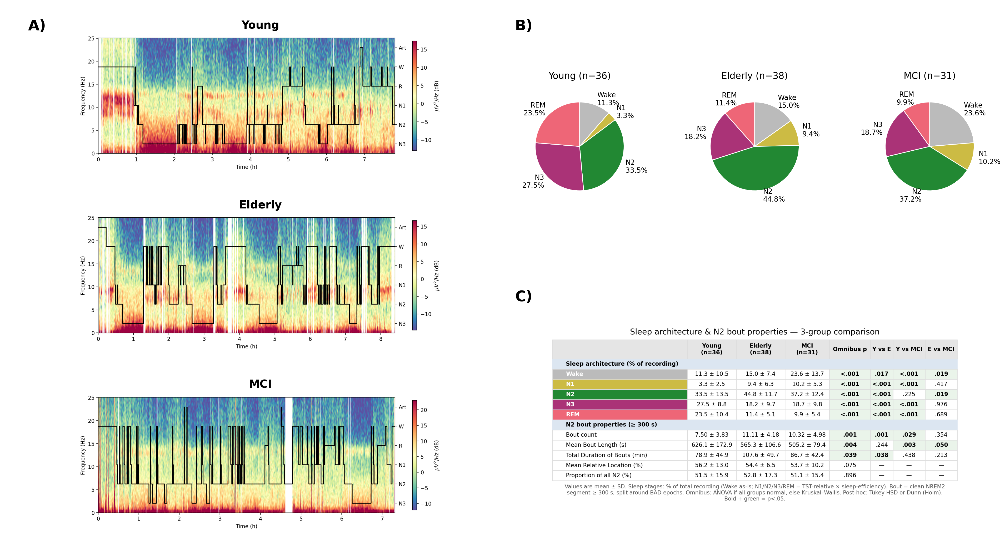

# Figures — V9 / sigma_fix regeneration (N=36 Young)

_Generated 2026-06-09. This is a standalone catalog of the figures regenerated after the
`|sigma|` + RY42 fixes (the "V2" per-subject results in `results/sigma_fix_{YA,HE,MCI}`) and
after adding EL3033 to the Young group (N 35 → 36). It is separate from
`thesis/figure_manifest.md`, which still points at the prior N=35 / V7–V8B set._

**What changed since the previous set**
- Inputs: group-comparison scripts now read per-subject ISFS metrics from `results/sigma_fix_*` (was `results/new_*_results`).
- Cohort: Young **36** (EL3033 added, 20.5% detection), Elderly **38**, MCI **31**.
- Topographies: option-B projection — `sphere='auto'`, `extrapolate='head'`, field + contours **clipped to the head circle** (clean complete circle, occiput low, ROI/post-hoc overlays unclipped).
- Output dirs (new, no overrides): group-comparison → `results/group_comparison_results/three_groups_V9`; demographics/sleep → `results/demographics_V2`.

Stats sources: `three_groups_V9/three_group_statistics.txt` (whole-scalp), `three_groups_V9/three_group_topo_statistics.txt` (cluster), `three_groups_V9/three_group_statistics_extended_ROI_normalized_auc.txt` (ROI).

---

## Table 1 — Participant demographics (N=36 Young)
`results/demographics_V2/demographics_table.png` (+ `.csv`, `.txt`)

- Young n=36, age 27.6 ± 4.9; Elderly n=38, age 66.5 ± 9.9 (MoCA 26.9 ± 2.5, n=18); MCI n=31, age 67.8 ± 9.0 (MoCA 21.0 ± 4.1, n=14).
- **Supports:** groups differ in age as expected and are comparable on data quality; defines the analysed sample.

## F1 — Sleep overview (composed)
`thesis/figures/hypno_sleep_stages_N36.png` — built by `code/make_f1_figure.py`:
- (a) three hypnospectrograms (Young=EL3011, Elderly=MCI27, MCI=YS0; per-subject titles cropped, group-name banners added)
- (b) sleep-stage pies (group means, % of recording; no stats table — that data is in panel c) — drawn natively from the sheet
- (c) combined sleep-architecture + N2-bout comparison table (`results/demographics_V2/combined_sleep_n2_table.png`)

- **Supports:** sleep architecture differs with age/impairment, but N2 (where ISFS occurs) remains plentiful in all groups.
- Component panels also live standalone in `results/demographics_V2/` (`sleep_stage_pies.png`, `combined_sleep_n2_table.png`). The hand-made N=34/N=35 composites (`hypno_sleep_stages_2.png`, `_N35.png`) are preserved.

## F2 — Methods flow + ROI (unchanged)
`thesis/figures/methods_flow_roi_v3.png` — fully code-generated by `code/make_f2_figure.py` (2026-06-15 rewrite). Conceptual; not affected by the sigma_fix re-run or N=36.

## F3 — Whole-scalp ISFS parameter violins
`results/group_comparison_results/three_groups_V9/group_comparison_violin.png` · stats `three_groups_V9/three_group_statistics.txt`

- Peak frequency higher in both older groups (Young < Elderly = MCI; ANOVA F=6.59, **p=0.0020**, η²=0.114; Tukey Y–E p=0.011, Y–MCI p=0.004, E–MCI ns).
- Bandwidth same direction and **now significant** at N=36 (ANOVA F=3.39, **p=0.038**, η²=0.062; Tukey Y–E p=0.045 sig, Y–MCI p=0.113 ns, E–MCI ns). *(Was ns, Kruskal–Wallis p=0.052 at N=35.)*
- Whole-scalp AUC unchanged (Kruskal–Wallis H=2.11, p=0.348).
- **Supports:** aging shifts ISFS peak frequency faster; bandwidth trends the same way and reaches significance in this sample; overall strength is unchanged. Headline temporal result.

## F4 — AUC topography + central-parietal cluster
`three_groups_V9/three_group_topo_auc.png` (normalized + cluster), `_auc_raw.png`; per-group `Young_/Elderly_/MCI_topographies_avg_{raw,normalized}.png` · stats `three_groups_V9/three_group_topo_statistics.txt`

- One significant central-parietal cluster: **p=0.016, 10 electrodes** (E130, E142, E143, E144, E153, E154, E155, E184, E185, E197). Post-hoc Young>Elderly at 5 electrodes, Young>MCI at 7, Elderly vs MCI 0. *(Was 9 electrodes at N=35; +E153.)*
- Green dots = pre-defined central-parietal ROI; black circles = significant post-hoc electrodes.
- **Supports:** the loss of ISFS strength is spatially focal (central-parietal), not global. Headline spatial result.

## F5 — ROI AUC (normalized violin)
`three_groups_V9/group_comparison_violin_extended_ROI_normalized_auc.png` · stats `three_groups_V9/three_group_statistics_extended_ROI_normalized_auc.txt`

- Group means in expected order (Young 1.099, Elderly 1.042, MCI 1.021); omnibus ns (ANOVA F=1.73, p=0.182).
- **Supports:** averaging across the whole ROI dilutes the focal cluster effect seen in F4.

## S1 — Peak-frequency and bandwidth topographies
`three_groups_V9/three_group_topo_peak_frequency.png`, `three_group_topo_bandwidth.png`

- Neither metric produced a significant spatial cluster (per `three_group_topo_statistics.txt`).
- **Supports:** the temporal alterations are diffuse rather than regionally localized.

## S2 — ISFS × MoCA correlation grid (unchanged)
`results/moca_correlation_V1/moca_correlations_grid.png` — elderly + MCI only; unaffected by the Young N change.

---

## F-stat topographies (diagnostic, not in main set)
`three_groups_V9/three_group_fstat_topo_{auc,peak_frequency,bandwidth}.png` — per-metric ANOVA F maps with cluster outlines.

## State summary — V9 (N=36, sigma_fix) vs previous (N=35, V7/V8B)

| Result | Previous (N=35) | New (N=36, sigma_fix / V9) | Change |
|---|---|---|---|
| Peak-freq omnibus | ANOVA p=0.0034, η²=0.107 | ANOVA p=0.0020, η²=0.114 | minor — stronger, still sig |
| Peak-freq post-hoc | Y–E p=0.018, Y–MCI p=0.005, E–MCI ns | Y–E p=0.011, Y–MCI p=0.004, E–MCI ns | minor |
| Peak-freq means (Hz) | — | Y 0.0199 / E 0.0227 / MCI 0.0232 | Y < E = MCI |
| **Bandwidth omnibus** | **Kruskal–Wallis p=0.052 (ns)** | **ANOVA p=0.038 (SIG)** | **MAJOR — ns → sig (test also switched KW→ANOVA, all groups now normal)** |
| Bandwidth post-hoc | none (omnibus ns) | Y–E p=0.045 (sig); Y–MCI p=0.113 (ns); E–MCI ns | new, driven by Young vs Elderly only |
| AUC whole-scalp | Kruskal–Wallis p=0.535 (ns) | Kruskal–Wallis p=0.348 (ns) | minor, still ns |
| AUC cluster | p=0.016, **9** electrodes | p=0.016, **10** electrodes (+E153) | minor — cluster slightly larger, holds |
| AUC cluster post-hoc | Y>E 7/9, Y>MCI 6/9, E–MCI 0 | Y>E 5/10, Y>MCI 7/10, E–MCI 0 | minor reshuffle; direction unchanged |
| ROI normalized-AUC | ANOVA p=0.194; Y 1.10 / E 1.05 / MCI 1.02 | ANOVA p=0.182; Y 1.099 / E 1.042 / MCI 1.021 | minor, still ns |
| Peak-freq / BW topo clusters | none significant | none significant | unchanged |
| MoCA correlations | all \|r\|≤0.13 (E+MCI, n=32) | not re-run (elderly+MCI, unaffected) | unchanged |
| Young demographics | n=35, age 27.6 ± 5.0 | n=36, age 27.6 ± 4.9 | EL3033 added |

**Bottom line.** The locked scientific story is intact and slightly strengthened: peak frequency is robustly
faster with age (Young < Elderly = MCI, p=0.002, both post-hocs significant), the central-parietal AUC
cluster holds (p=0.016, now 10 electrodes), Elderly = MCI on every measure, and MoCA is null. **The one
material change** is bandwidth: at N=36 the whole-scalp omnibus is now significant (ANOVA p=0.038) where it
was ns at N=35 (KW p=0.052). This is marginal and partly a test-choice effect — at N=36 all three groups
pass normality so the parametric ANOVA is used instead of Kruskal–Wallis — and only the Young-vs-Elderly
pairwise survives (Young-vs-MCI ns). It should be reported cautiously as a borderline trend, not a robust
group difference, and the scientific-story / paper text that currently states "bandwidth not significant"
needs revisiting.

## Regeneration note
- All group-comparison + demographics scripts re-run 2026-06-09; counts verified Young 36 / Elderly 38 / MCI 31 in every script.
- F1 composite assembled 2026-06-11 via `code/make_f1_figure.py` → `thesis/figures/hypno_sleep_stages_N36.png` (3469×1835).

---

# V10 / final-cohort regeneration (N=35 / 39 / 30) — 2026-06-17

_Supersedes everything above. After tightening the exclusion criteria — minimum three clean N2 bouts,
TST ≥ 210 min, DS6 re-included in Elderly, MR5 added to MCI, HG78/MCI13/SM07 dropped — the whole analysis
was re-run at the **final cohort Young 35 / Elderly 39 / MCI 30 (total 104)**._

**Source-of-truth dirs:** group comparison `results/group_comparison_results/three_groups_V10`;
demographics/sleep `results/demographics_V3`; MoCA `results/moca_correlation_V3`; per-subject ISFS
`results/sigma_fix_{YA,HE,MCI}`. Composites regenerated to **new V10 names** (V9 PNGs preserved):
`thesis/figures/hypno_sleep_stages_V10.png` (F1), `f4_auc_composite_V10.png` (F4),
`s1_topo_composite_V10.png` (S1). `make_topo_composites.py` repointed V9→V10; `make_f1_figure.py`
repointed demographics_V2→V3.

## State summary — V10 (N=35/39/30) vs V9 (N=36/38/31)

| Result | V9 (N=36) | V10 (final cohort) | Change |
|---|---|---|---|
| Peak-freq omnibus | ANOVA p=0.0020, η²=0.114 | ANOVA F=6.32, **p=0.0026**, η²=0.111 | minor — still sig |
| Peak-freq post-hoc | Y–E 0.011, Y–MCI 0.004, E–MCI ns | Y–E **0.013**, Y–MCI **0.005**, E–MCI ns (p=0.86) | minor |
| Peak-freq means (Hz) | Y 0.0199 / E 0.0227 / MCI 0.0232 | Y 0.0199 / E **0.0226** / MCI 0.0232 | unchanged direction |
| **Bandwidth omnibus** | **ANOVA p=0.038 (SIG)** | **ANOVA F=2.87, p=0.061 (NS)** | **MAJOR — flipped sig → ns** |
| Bandwidth post-hoc | Y–E 0.045 (sig) | none (omnibus ns) | dropped |
| Bandwidth means (Hz) | Y 0.0234 / E 0.0283 / MCI 0.0277 | Y 0.0236 / E 0.0281 / MCI 0.0276 | unchanged direction |
| AUC whole-scalp | KW p=0.348 (ns) | KW H=1.96, **p=0.376** (ns) | minor, still ns |
| AUC cluster | p=0.016, **10** electrodes | **p=0.023, 9** electrodes (**E142 dropped**) | weaker, holds |
| AUC cluster post-hoc | Y>E 5/10, Y>MCI 7/10, E–MCI 0 | Y>E 5/9, Y>MCI 7/9, **E–MCI 1/9 (E197)** | minor reshuffle |
| ROI normalized-AUC | ANOVA p=0.182; Y 1.099 / E 1.042 / MCI 1.021 | ANOVA F=1.99, **p=0.143**; Y 1.099 / E **1.040** / MCI **1.012** | minor, still ns |
| Peak-freq / BW topo clusters | none significant | none significant | unchanged |
| MoCA correlations | \|r\|≤0.12, p≥0.45 (n=43) | all \|r\|≤0.15, **p≥0.34 (n=44)** | unchanged (still null) |
| Detection (Y/E/MCI) | — | 74.5 / 85.6 / 82.0% (overall 80.8%) | — |
| Bouts (total / mean) | 1013 / 9.6 | **1023 / 9.8** (range 3–21) | — |
| Demographics | Y36 / E38 / MCI31 | **Y35 / E39 / MCI30**; ages 27.1±4.3 / 66.5±9.7 / 67.8±9.1 | cohort change |

**Bottom line.** The locked story is intact: peak frequency robustly faster with age (Young < Elderly =
MCI, p=0.0026), the central-parietal AUC cluster holds (p=0.023, 9 electrodes), Elderly = MCI on every
measure, MoCA null. **The one material change vs V9 is bandwidth, which flipped from borderline-significant
(p=0.038) back to not significant (p=0.061).** Across cohorts it has been ns (N=35, p=0.052) → sig (N=36,
p=0.038) → ns (final, p=0.061), so it is borderline and sensitive to which subjects are included and must
be reported as a trend, not an established effect. Manuscript text (Results §4.3, Discussion, captions,
manifest) updated accordingly 2026-06-17.
